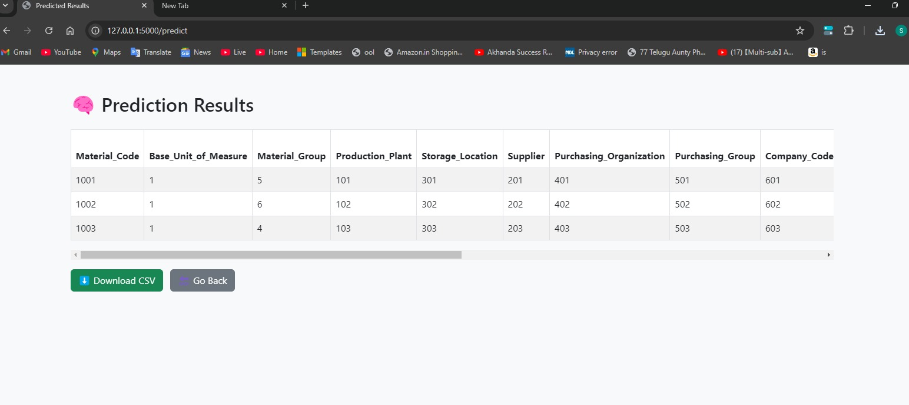
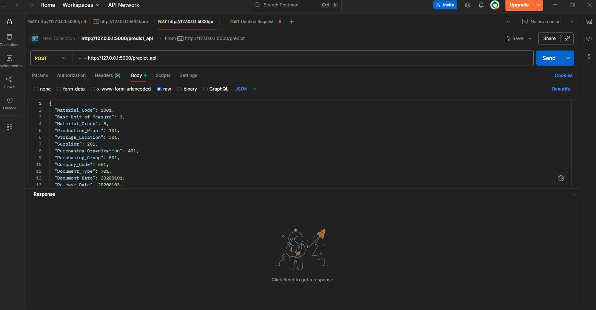
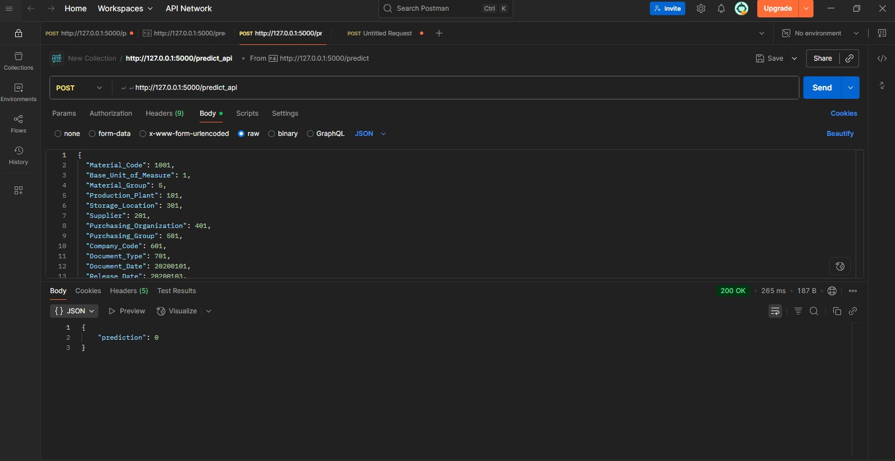
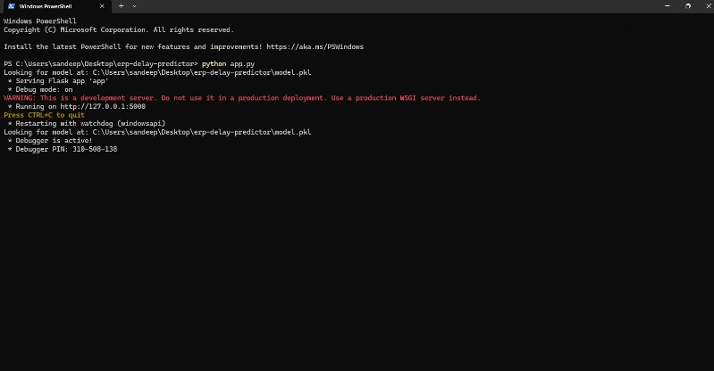

# ERP Delay Predictor

A web-based Machine Learning application designed to predict delays in ERP processes using logistic regression. Built with Flask, Bootstrap, and a clean modular architecture for scalability.

---

## 🚀 Features

- Predict ERP delays using trained ML model
+ Predict ERP delays using Random Forest Machine Learning model
- Intuitive Bootstrap UI
- Modular structure for maintainability
- REST API for prediction
- Cleaned and preprocessed ERP dataset


## 🛠️ Tech Stack

- Python (Flask)
- Scikit-learn
- Pandas, NumPy
- HTML/CSS (Bootstrap)
- GitHub + Git

---

## 📁 Project Structure

```
erp-delay-predictor/
│
├── api.py                 # REST API using Flask
├── train_model.py         # Script to train and save model
├── model/                 # Folder storing trained model (.pkl)
├── requirements.txt       # Project dependencies
└── README.md              # Documentation
```

---

## 📦 Installation

```bash
# Clone the repository
git clone https://github.com/Vsandeep-ai-dev/erp-delay-predictor.git
cd erp-delay-predictor

# Create a virtual environment
python -m venv venv
source venv/bin/activate  # or venv\Scripts\activate on Windows

# Install dependencies
pip install -r requirements.txt
```

---

## 🧠 How It Works

1. Upload or input data via UI or API.
2. Data is cleaned using `cleaner.py`.
3. Prediction is made using the trained model.
4. Train the model (required before running API)
python train_model.py.
5. Output is shown in browser.
🔍 Model

The model used is a **Random Forest Classifier**, trained on a custom ERP dataset to predict delivery delays based on key features like quantity, price, rating, vendor score, shipping speed, and demand.
---

## ▶️ Run the App

```bash
python api.py
```

Visit [http://localhost:5000](http://localhost:5000) in your browser.

---

## 📽️ Demo Video

▶️ [https://www.loom.com/share/f1d02adf9a75416e882f5dfb34631bb7?sid=f64df542-f75b-4360-82f6-bd60ef159366]
## 🖼️ Screenshots

### 🖥️ UI (Browser)
**Homepage:**


**Prediction Result:**


---

### 📬 API Call via Postman

**Input JSON:**


**Output Prediction:**


---

### 🖥️ Terminal Execution

**Running the App:**


**Prediction Completed:**


- **Endpoint:** `/predict`
- **Method:** POST
- **Payload Example:**
```json

  {
  "quantity": 50,
  "price": 15.0,
  "rating": 4,
  "vendor_score": 8,
  "ship_speed": 2,
  "demand": 60
}
  ...

```

---

## 📌 Topics

- Machine Learning
- Flask Web App
- ERP Systems
- Logistic Regression
- API Deployment
- UI with Bootstrap
- Random Forest Classifier
-
---

## 🔒 Repository Status

> ✅ Public and ready to showcase.

---

## 📧 Contact

- Developer: [Sandeep Reddy](mailto:your-email@example.com)
- GitHub: [@Vsandeep-ai-dev](https://github.com/Vsandeep-ai-dev)

---


